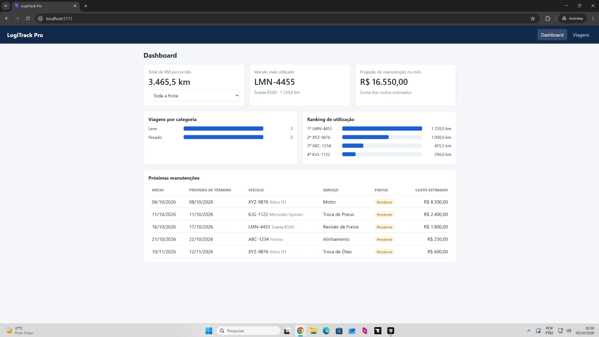
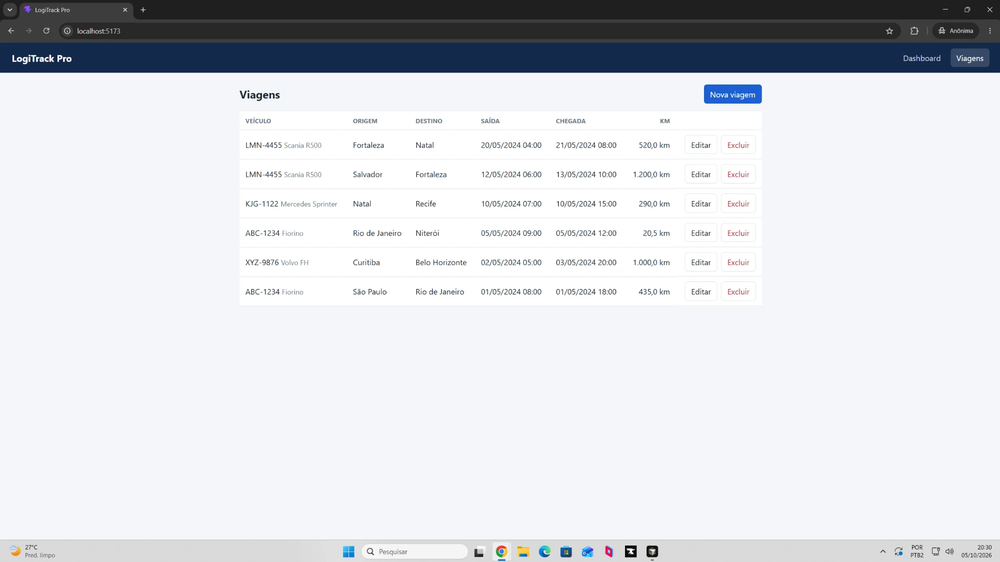
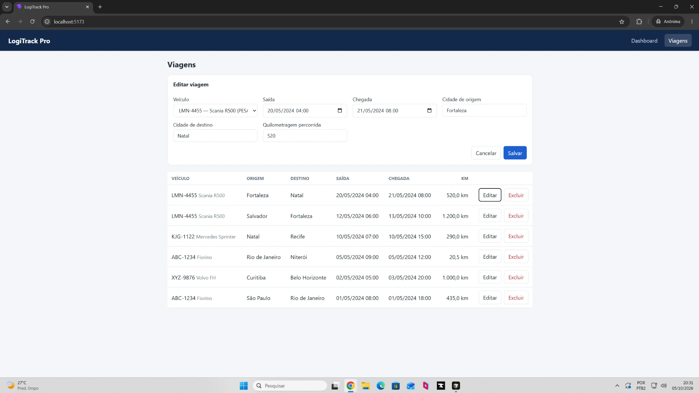

# LogiTrack Pro

MVP de gestão de frota: CRUD do **Módulo de Viagens** e um **Dashboard** com 5 métricas extraídas via SQL.

O backend existe em duas versões com a mesma API (mesmas URLs e mesmo JSON):

| Pasta | Tecnologia | Porta |
|---|---|---|
| `backend-python/` | Python 3.12 + Django 5.2 | 8000 |
| `backend-java/` | Java 17+ + Spring Boot *(em desenvolvimento)* | 8080 |
| `frontend/` | React 19 + Vite | 5173 |
| `database/` | PostgreSQL 16 (Docker) | 5432 |

O frontend é um só e funciona com qualquer um dos dois backends.

## Demonstração

**Dashboard:** as 5 métricas (total de KM com filtro por veículo, veículo mais utilizado, projeção financeira do mês, viagens por categoria, ranking de utilização e próximas manutenções).



**Viagens:** listagem com as ações de editar e excluir.



**Cadastro e edição de viagem:** o mesmo formulário serve para criar e editar.



## Como rodar localmente

Pré-requisitos: Docker Desktop, Python 3.12+ e Node.js 20+.

### 1. Banco de dados

```bash
docker compose up -d db
```

Na primeira vez, o PostgreSQL executa automaticamente os scripts da pasta `database/`, em ordem.
Para recriar o banco do zero: `docker compose down -v` e depois `docker compose up -d db`.

### 2. Backend Python (Django)

```bash
cd backend-python
python -m venv .venv
.venv\Scripts\activate          # Windows  (Linux/Mac: source .venv/bin/activate)
pip install -r requirements.txt
python manage.py migrate        # cria só as tabelas internas do Django (usuários, sessões, admin)
python manage.py runserver
```

### 3. Frontend (React)

```bash
cd frontend
npm install
npm run dev
```

Acesse http://localhost:5173.

## API

| Método | URL | Descrição |
|---|---|---|
| GET | `/api/csrf/` | Envia o cookie CSRF para o navegador |
| GET | `/api/veiculos/` | Lista os veículos (usado no campo de seleção) |
| GET | `/api/viagens/` | Lista as viagens |
| POST | `/api/viagens/` | Cria uma viagem |
| GET | `/api/viagens/{id}/` | Detalha uma viagem |
| PUT | `/api/viagens/{id}/` | Atualiza uma viagem |
| DELETE | `/api/viagens/{id}/` | Exclui uma viagem |
| GET | `/api/dashboard/?veiculo_id={id}` | As 5 métricas (o filtro de veículo é opcional e vale para o total de KM) |

Exemplo de corpo para POST/PUT:

```json
{
  "veiculo_id": 1,
  "data_saida": "2026-10-01T08:00",
  "data_chegada": "2026-10-01T18:00",
  "origem": "São Paulo",
  "destino": "Rio de Janeiro",
  "km_percorrida": 435
}
```

Erros de validação voltam com status 400 no formato `{"erros": {"campo": ["mensagem"]}}`.

## Dashboard: as 5 consultas SQL

Todas ficam em `backend-python/frota/consultas.py`.

| Métrica | Como é calculada |
|---|---|
| Total de KM percorrido | `SUM(km_percorrida)` em `viagens`, com `WHERE veiculo_id = ?` opcional |
| Volume por categoria | `veiculos LEFT JOIN viagens`, `COUNT` agrupado por `tipo` (LEVE / PESADO) |
| Cronograma de manutenção | `manutencoes JOIN veiculos`, a partir de hoje, sem as concluídas, `ORDER BY data_inicio LIMIT 5` |
| Ranking de utilização | `SUM(km_percorrida)` agrupado por veículo, `ORDER BY` decrescente. O primeiro é o mais utilizado |
| Projeção financeira | `SUM(custo_estimado)` das manutenções com início dentro do mês atual |

## Decisões técnicas

- **Banco criado pelo script fornecido.** Os models do Django usam `managed = False` e `db_table`. O Django lê e grava nas tabelas, mas não altera a estrutura delas. O script continua sendo a fonte da verdade.
- **SQL puro no dashboard.** O desafio exige as métricas via SQL. No Django isso é feito com `connection.cursor()`, como na documentação oficial. Os valores do usuário vão como parâmetro (`%s`), o que evita SQL injection.
- **ORM no CRUD.** Para criar, listar, editar e excluir viagens, o ORM do Django é suficiente e mais legível. A validação é feita por um `ModelForm` (`frota/forms.py`), que também impede chegada antes da saída e quilometragem negativa.
- **Views simples com `JsonResponse`.** Sem bibliotecas extras (como Django REST Framework), para manter o código pequeno e fácil de acompanhar.
- **CSRF ativo.** O frontend lê o cookie `csrftoken` e o envia no cabeçalho `X-CSRFToken`, como a documentação do Django descreve para requisições AJAX.
- **Proxy do Vite.** Em desenvolvimento, o Vite repassa `/api` para o backend. Por isso o backend não precisa de configuração de CORS.

## Alterações no banco de dados

O script original (`database/01_carga_inicial.sql`) não foi modificado. Foi adicionado o `database/02_dados_extras.sql`, com:

1. **Manutenções com datas relativas a `CURRENT_DATE`.** Os dados originais são de 2024, então o "Cronograma" (próximas manutenções) e a "Projeção do mês atual" ficariam sempre vazios.
2. **Viagens para os veículos 3 e 4,** que não tinham nenhuma. Assim o ranking e o volume por categoria ficam mais representativos.
3. **Índices** em `viagens(veiculo_id)` e `manutencoes(data_inicio)`, que são as colunas usadas nos `JOIN`, `WHERE` e `ORDER BY` do dashboard. O PostgreSQL não cria índices automaticamente em chaves estrangeiras.
